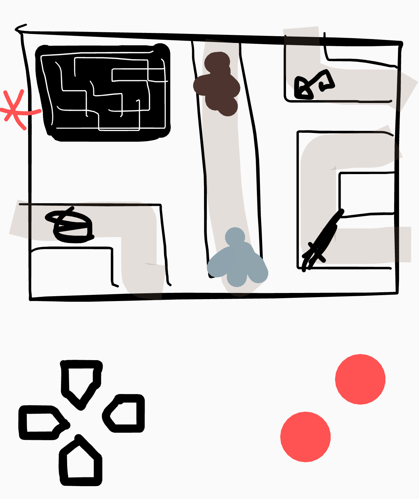

# [Minautor](https://maxime-hanicotte.github.io/Minautor/)

## Les élements du jeu
* Un Minotaure
* Un Thésée
* Une épée (tue le Minotaure - bouton A)
* Une pelote (dévoile le chemin parcouru sur mini carte - bouton B)
* Une clé (permet de sortir - bouton A)
* Des points de départ
* Une porte de sortie
* Génération aléatoire du labyrinthe (miroir + puzzle)
* Déplacement aléatoire du Minotaure
* Lorsqu’on allume un résumé du mythe défile (peut être passé)
* On choisi la taille du labyrinthe petit 2x2 normal 3x3 grand 4x4
* Activer son
* Activer led (aide radar bleu épée, vert ariane, rouge clef, minotaure??)
* Choix d’un thème (skins du terrain)
* Lorsqu’on fini une image apparaît avec Thesee tuant le Minotaure
* Si on s’approche du bord de la carte on est transporté à l’opposé
* Enregistrer les records de temps par catégories

--
