# "Revivez le mythe sur Arduboy"

## Reprise du dev sur VS Code

Guide d'installation et workflow Linux/Arduboy: [DEV_SETUP.md](DEV_SETUP.md)

## Les élements du jeu

### Implémenté

* Un Minotaure 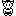 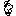 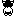 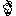
* Un Thésée (armé ou non) 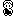 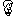 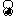 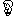
* Une épée (ramassable) 
* Une pelote (ramassable) 
* Une clé (ramassable) 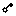
* Des points de départ 
* Une porte de sortie 
* Menu principal (Play / Help / Credits)
* Écran d’aide avec les contrôles
* Écran crédits (galerie de sprites)
* 3 niveaux avec collisions et positions de spawn distinctes
* Transformation Thésée ↔ Minotaure (touche B)
* Équipement de l’épée au ramassage (touche A pour dégainer)
* Retour au menu depuis n’importe quel écran (A+B)
* Choix d’un thème de terrain 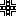  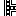  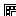  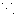

### Roadmap

* Génération aléatoire du labyrinthe (miroir + puzzle)
* Déplacement aléatoire du Minotaure
* Résumé du mythe au démarrage (peut être passé)
* Choix de la taille du labyrinthe (petit 2×2 / normal 3×3 / grand 4×4)
* Son
* LED radar (bleu épée, vert ariane, rouge clef)
* Image de fin (Thésée tuant le Minotaure)
* Téléportation aux bords de la carte
* Enregistrement des records de temps par catégorie

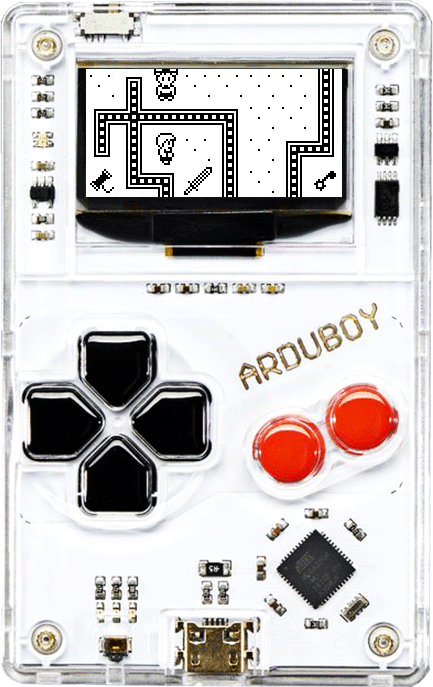

--
