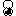

# "Revivez le mythe sur Arduboy"

## Les élements du jeu

* Un Minotaure    
* Un Thésée    
* Une épée 
* Une pelote 
* Une clé 
* Des points de départ
* Une porte de sortie
* Génération aléatoire du labyrinthe (miroir + puzzle)
* Déplacement aléatoire du Minotaure
* Lorsqu’on allume un résumé du mythe défile (peut être passé)
* On choisi la taille du labyrinthe petit 2x2 normal 3x3 grand 4x4
* Activer son
* Activer led (aide radar bleu épée, vert ariane, rouge clef, minotaure??)
* Choix d’un thème (skins du terrain)    
* Lorsqu’on fini une image apparaît avec Thesee tuant le Minotaure
* Si on s’approche du bord de la carte on est transporté à l’opposé
* Enregistrer les records de temps par catégories

--
